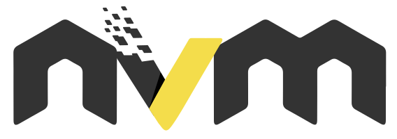

Installing Node.js LTS version
==============================

CURL installation script
------------------------

Open a terminal and run the bash script to install CURL.

`$ ./install-curl.sh`

After running the script close and open a new terminal and enter the following command to finish the installation.

`$ nvm install --lts`

To check the installation of node.js enter the command:

`$ node -v`

* * *

What is CURL?
-------------

curl is used in command lines or scripts to transfer data. curl is also used in cars, television sets, routers, printers, audio equipment, mobile phones, tablets, settop boxes, media players and is the Internet transfer engine for thousands of software applications in over ten billion installations

[https://curl.se/](https://curl.se/)

* * *

What is nvm?
------------

nvm is a version manager for node.js, designed to be installed per-user, and invoked per-shell. nvm works on any POSIX-compliant shell (sh, dash, ksh, zsh, bash), in particular on these platforms: unix, macOS, and windows WSL.

* * *

What is NPM?
------------

npm es el sistema de gestión de paquetes por defecto para Node.js, un entorno de ejecución para JavaScript, bajo Artistic License 2.0.
